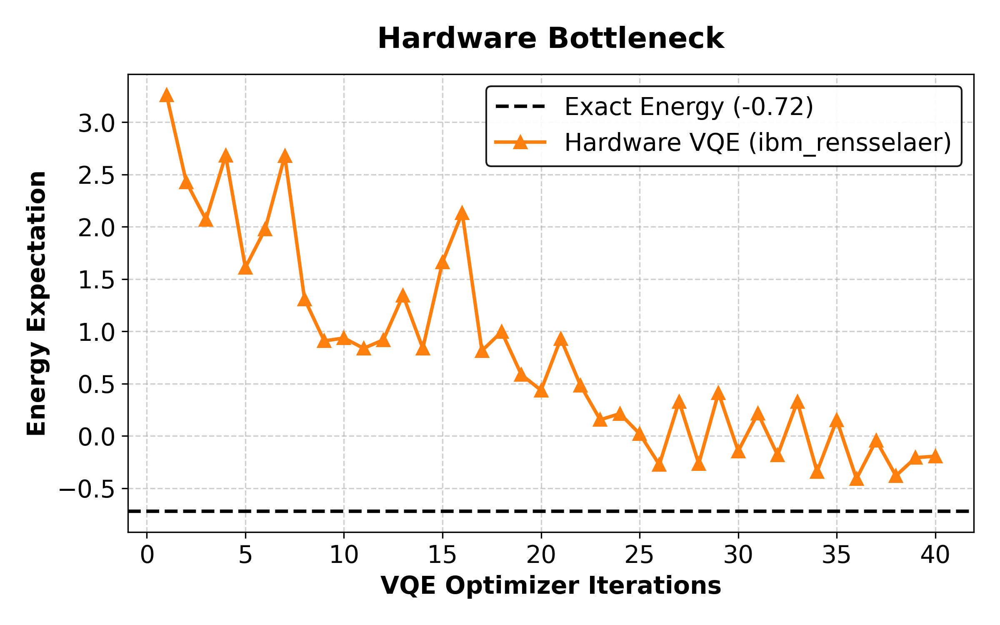

## Current Work

I am working with Benchmarking the Spin-Boson Model on quantum computers focusing specifically on the quantum algorithms of VQE and SQD

## Poster Presentations

APS March Meeting 2026 

## Publications

S.Jang, A. G.Colliton, H. S.Flaih, E. M. K.Irgens, L. J.Kramarczuk, G. D.Rauber, J.Vickers, A. L.Ogrinc, Z.Zhang, Z.Gong, Z.Chen, B. P.Borovsky, S. H.Kim, Why is Superlubricity of Diamond-Like Carbon Rare at Nanoscale?. Small2024, 20, 2400513. https://doi.org/10.1002/smll.202400513

